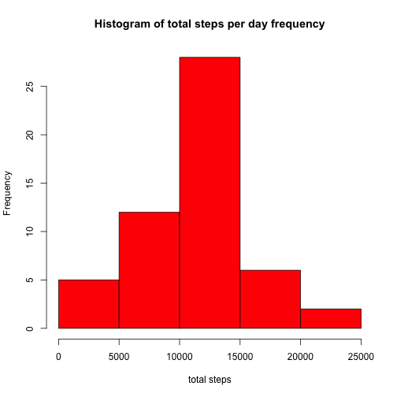
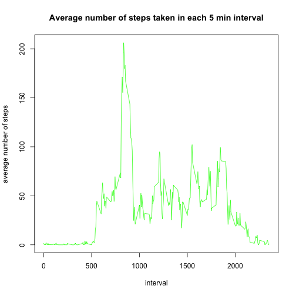
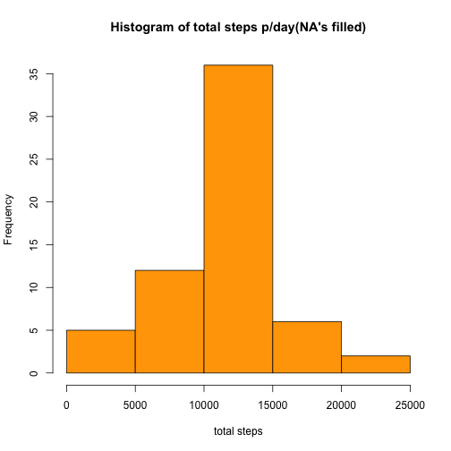
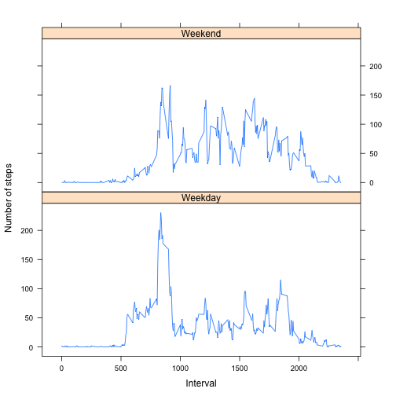

# PA1_template
## Loading and preprocessing the data
Load the data (i.e. read.csv())

```r
library(knitr)
actraw <- read.csv("activity.csv", header = T, na.strings="NA")
```
Process/transform the data (if necessary) into a format suitable for your analysis

```r
act <- na.omit(actraw)
aggdate <- aggregate(steps ~ date, act, sum)
```
*Research note: the data set was fairly tidy, I removed the NA's initially.*
## What is mean total number of steps taken per day?
Make a histogram of the total number of steps taken each day

```r
hist(aggdate$steps, main= "Histogram of total steps per day frequency", col= "red", xlab= "total steps")
```

 

Calculate and report the mean and median total number of steps taken per day

```r
mean(aggdate$steps)
```

```
## [1] 10766
```

```r
median(aggdate$steps)
```

```
## [1] 10765
```
*Research note: The mean total steps was 10,766 and the median total steps was 10,765. These 2 observation are very close indicating the distribution is quite centered.*
## What is the average daily activity pattern?
Make a time series plot (i.e. type = "l") of the 5-minute interval (x-axis) and the average number of steps taken, averaged across all days (y-axis)

```r
byinterval <- aggregate(steps ~ interval, act, mean)
colnames(byinterval) <- c("interval", "stepsavg")
plot(byinterval$interval, byinterval$stepsavg, type="l", 
     main="Average number of steps taken in each 5 min interval", col="green", xlab ="interval", ylab = "average number of steps")
```

 

Which 5-minute interval, on average across all the days in the dataset, contains the maximum number of steps?

```r
max <- max(byinterval$stepsavg)
maxint <- subset(byinterval, stepsavg == max)
print(maxint)
```

```
##     interval stepsavg
## 104      835    206.2
```
*Research note: the maximum number of steps was at the 835 interval. This is confirmed visually by the graph above.*
## Imputing missing values
Calculate and report the total number of missing values in the dataset (i.e. the total number of rows with NAs)

```r
sum(is.na(actraw$steps))
```

```
## [1] 2304
```
*Research note: There are 2304 missing values.* 

Create a new dataset that is equal to the original dataset but with the missing data filled in.

```r
newact <- merge(actraw, byinterval, by ="interval")
newact$steps <- with(newact, ifelse(is.na(steps), stepsavg,steps))
nafill <- aggregate(steps ~ date, newact, sum)
```
*Research note: the strategy used to fill the NA's was to input averages for the missing values. Other strategies such as using the last value, and interpolating points were considered, however we decided against them during the project.*

Make a histogram of the total number of steps taken each day and Calculate and report the mean and median total number of steps taken per day. Do these values differ from the estimates from the first part of the assignment? What is the impact of imputing missing data on the estimates of the total daily number of steps?

```r
hist(nafill$steps, main= "Histogram of total steps p/day(NA's filled)", col= "orange", xlab= "total steps")
```

 


```r
mean(nafill$steps)
```

```
## [1] 10766
```

```r
median(nafill$steps)
```

```
## [1] 10766
```
*Research note: The mean remains the same and median has a slight variation.*
## Are there differences in activity patterns between weekdays and weekends?
Create a new factor variable in the dataset with two levels -- "weekday" and "weekend" indicating whether a given date is a weekday or weekend day.

```r
newact$day <- weekdays(as.Date(newact$date))
newact$wkd <- as.factor(ifelse(newact$day %in% c("Saturday","Sunday"), "Weekend", "Weekday"))
nonaint <- aggregate(steps~ interval+wkd, newact, mean)
```
Make a panel plot containing a time series plot (i.e. type = "l") of the 5-minute interval (x-axis) and the average number of steps taken, averaged across all weekday days or weekend days (y-axis). 


```r
library(lattice)
xyplot(steps ~ interval| wkd, data = nonaint,
       type = "l", xlab = "Interval",ylab = "Number of steps",
           layout=c(1,2))
```

 

